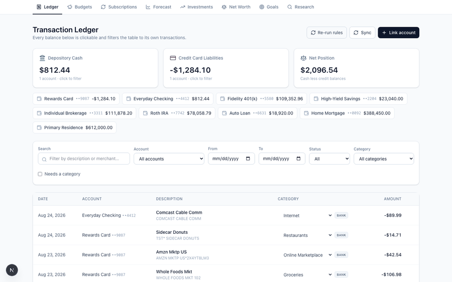
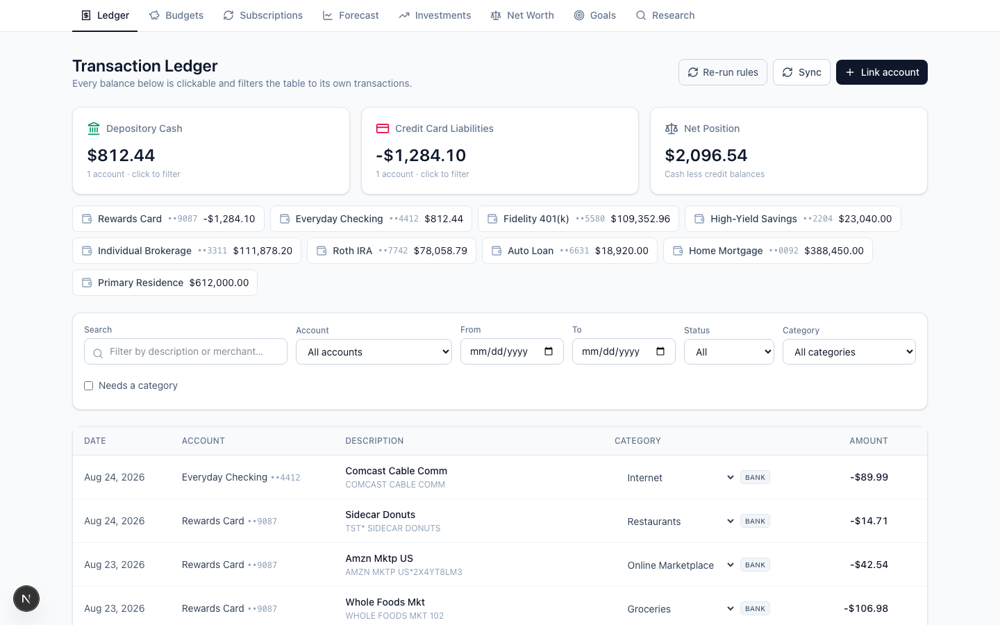
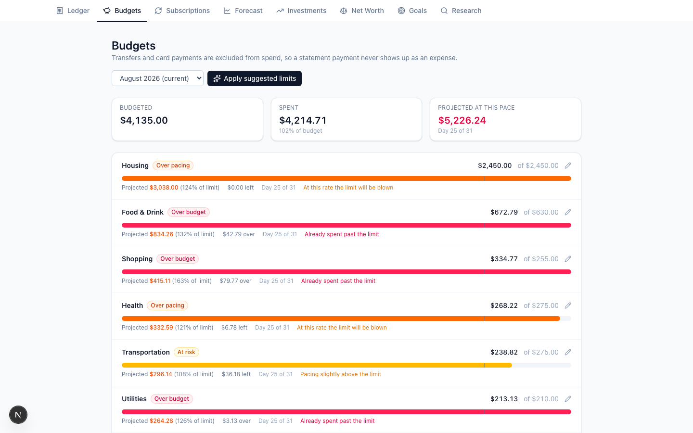
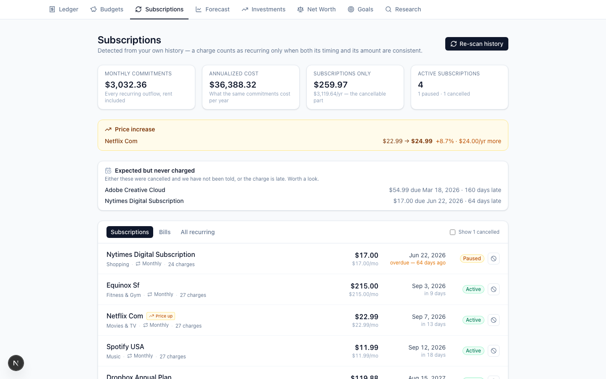
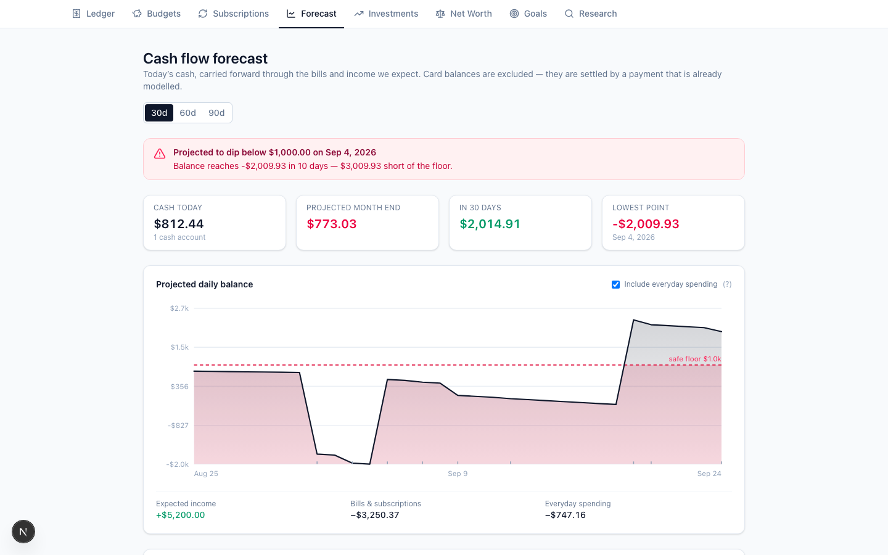
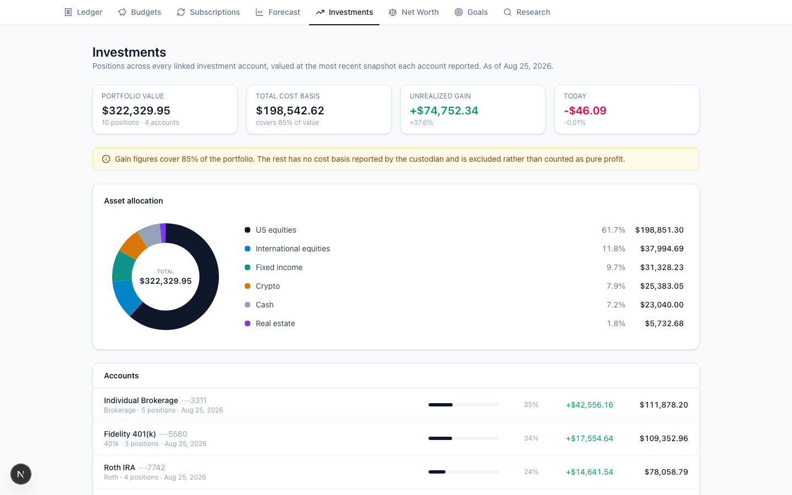
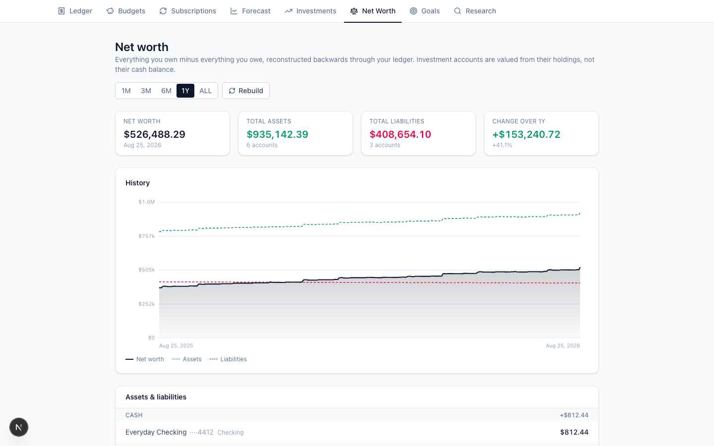
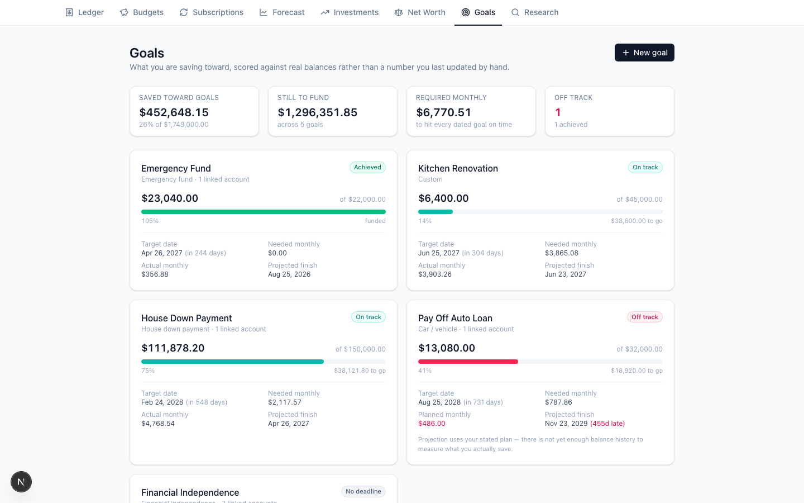
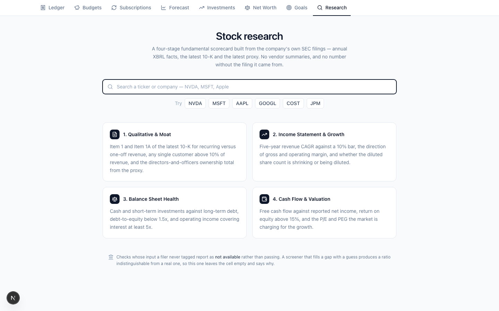
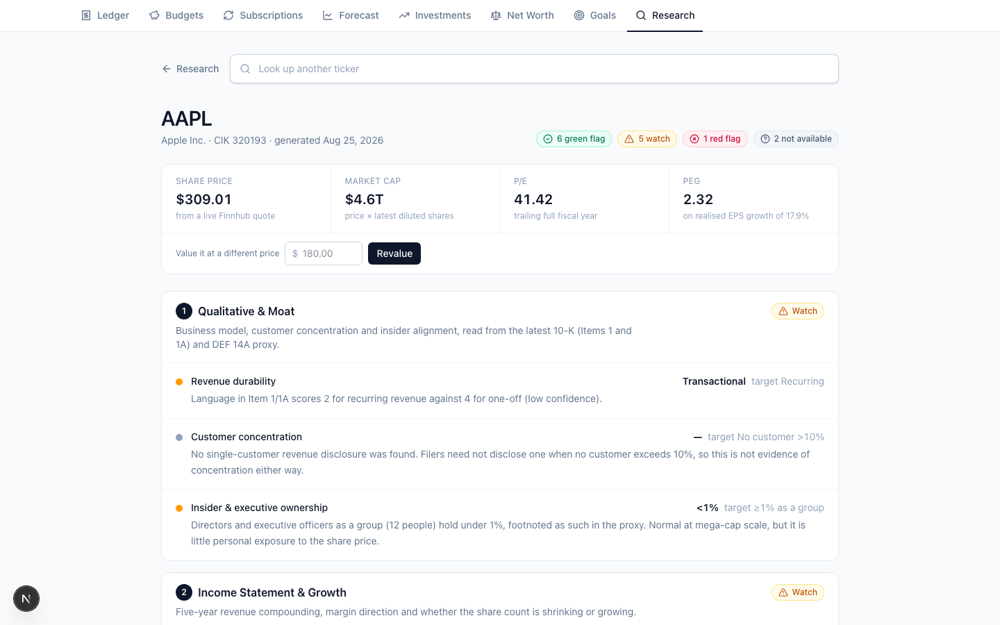

# Personal Finance & Investment Platform

A full-stack budgeting and investing platform I built for my own money — real
bank/brokerage aggregation via Plaid, a four-layer transaction categorization
engine, cash-flow forecasting, portfolio and net-worth tracking, and a
from-scratch equity research tool that scores public companies straight from
their SEC filings.

It's built in five numbered phases, each with its own migration, service
layer, and UI. Screenshots below are from the app running against a
deterministic synthetic dataset (`app.seeds.demo` / `app.seeds.investments`) —
no real account data ever leaves my machine, and the repo ships everything
needed to generate the same fixtures yourself.



---

## Why this exists

It's a real system I use to manage real money, so **correctness beat speed
everywhere it mattered**: integer-cents storage (never a float touches a
dollar amount), idempotent Plaid ingestion, raw-payload preservation for
replay, and a database `CHECK` constraint that ties transaction direction to
the sign of the amount so a bad write fails loudly instead of quietly
corrupting a balance.

Auth is deliberately out of scope — it's a single-user system seeded from
`DEV_USER_EMAIL` — but the `user → item → account → transaction` ownership
chain is enforced in every query from day one, so bolting on real auth later
is a swap of one function, not a schema rework.

---

## Feature tour

### Transaction ledger & Plaid ingestion (Phase 1)

Cursor-based delta sync against Plaid's `transactions_sync`, with pending →
posted collapsing (a bank issues a pending auth, then a *separate* posted
transaction later — naive ingestion double-counts it), Fernet-encrypted access
tokens, and a Redis lock per item so a webhook and a manual sync can never
race the same cursor. Every balance on screen is clickable and drills into
its own filtered transaction list.



### Categorization, transfers & budgets (Phase 2)

A four-layer categorization engine (user rules → merchant defaults → Plaid's
category → uncategorized, first match wins, and a human's choice can never be
silently overwritten) feeds a pacing-aware budget view. Internal transfers and
credit-card payments are detected and excluded from spend — otherwise paying
your own card is double-counted as the largest "expense" of the month.



### Recurring detection, subscriptions & forecasting (Phase 3)

Recurring streams are promoted only when **both** a cadence test and an
amount test agree — cadence alone would flag a daily coffee habit as a
subscription, amount alone would flag every stable-priced purchase as
recurring. The subscriptions view surfaces price hikes, cancelled plans, and
"expected but never charged" gaps; the forecast projects daily cash balance
forward and flags the date it's expected to dip below a safe floor.




### Investments, net worth & goals (Phase 4)

Portfolio value is resolved per account from each account's *newest* snapshot
independently (a global `MAX(as_of_date)` would silently drop an account that
synced on a different day and under-report the portfolio with no error). Cost
basis is nullable and excluded from gain calculations when unknown, rather
than defaulting to zero and reporting an ACATS-transferred position as 100%
profit. Net worth is reconstructed backwards through the ledger for days with
no stored snapshot, and every balance's sign is derived from account type
rather than trusted, since Plaid and the demo fixtures disagree on sign
convention for the same account type.





### Equity research: a four-stage SEC-sourced scorecard (Phase 5)

Look up any SEC-registered ticker and get a **four-stage fundamental
scorecard** built entirely from that company's own filings — no vendor
fundamentals API, because the whole point is that every number is auditable
back to a specific accession number on EDGAR:

1. **Qualitative & Moat** — revenue durability (recurring vs. transactional,
   classified from 10-K Item 1/1A language), customer concentration (>10% of
   revenue from one customer), insider & executive ownership from the DEF 14A
   proxy.
2. **Income Statement & Growth** — 5-year revenue CAGR against a 10% bar,
   gross/operating margin direction, and whether the diluted share count is
   shrinking (buybacks) or growing (dilution).
3. **Balance Sheet Health** — cash & short-term investments vs. long-term
   debt, debt-to-equity below 1.5x, operating income covering interest
   expense at least 5x (skipped for banks, where interest is the cost of
   funds, not debt service).
4. **Cash Flow & Valuation** — free cash flow vs. net income (earnings
   quality), return on equity above 15%, and the P/E and PEG the market is
   charging for that growth.

Every check ships PASS/WARN/FAIL/**UNKNOWN** — a missing input is never
silently treated as a pass, and a negative-equity or zero-base input returns
"not meaningful" rather than a technically-valid, financially-nonsense ratio.
The XBRL parser also detects and restates stock splits across the taxonomy
change that would otherwise show NVIDIA's 10-for-1 as 880% dilution.




*(Full scorecard: [`docs/screenshots/research-aapl.png`](docs/screenshots/research-aapl.png))*

---

## Architecture

```
.
├── docker-compose.yml        # TimescaleDB + Redis (+ optional dockerized API)
├── backend/                  # FastAPI + SQLAlchemy + Alembic
│   ├── alembic/versions/     # 0001 schema · 0002 categorization/budgets ·
│   │                         # 0003 recurring/forecast · 0004 investments/goals
│   └── app/
│       ├── core/             # config, db session, redis, encryption
│       ├── models/           # account, transaction, budget, recurring_stream,
│       │                     # holding, investment_transaction, financial_goal, …
│       ├── schemas/          # pydantic request/response models
│       ├── routers/          # plaid, accounts, transactions, budgets, recurring,
│       │                     # forecast, investments, net_worth, goals, research
│       ├── services/         # ingestion, matching, normalization, categorization,
│       │                     # transfers, budgets, recurring, forecasting,
│       │                     # investment, net_worth, goals, sec_client, xbrl,
│       │                     # filings, market_data, research
│       └── seeds/            # deterministic synthetic fixtures for every phase
└── frontend/                 # Next.js App Router + Tailwind + hand-rolled SVG charts
    └── app/
        ├── budgets/ subscriptions/ forecast/ investments/
        ├── net-worth/ goals/ research/[ticker]/
        └── page.tsx           # ledger
```

**Backend:** FastAPI (sync endpoints on the threadpool — the work is blocking
Plaid/SEC HTTP calls and blocking Redis, so `async def` would only stall the
event loop), SQLAlchemy 2.x + Alembic, PostgreSQL via TimescaleDB (hypertable
for balance snapshots), Redis for per-item sync locks, Fernet for
encryption-at-rest, `httpx` for SEC EDGAR with an explicit rate limiter.

**Frontend:** Next.js App Router, Tailwind, hand-rolled SVG charts (no
charting library) for the balance/net-worth/allocation/forecast views.

---

## Getting started locally

### Prerequisites

| Tool | Version |
| --- | --- |
| Docker Desktop | any recent (verified 29.6.2 / Compose v5.3.1) |
| Python | 3.11+ (3.14 verified) |
| Node.js | 20+ (24 verified) |

### 1. Configure environment

```bash
cp .env.example .env
python3 -c "from cryptography.fernet import Fernet; print(Fernet.generate_key().decode())"  # paste into ENCRYPTION_KEY
python3 -c "import secrets; print(secrets.token_urlsafe(32))"                               # paste into API_KEY

git config core.hooksPath .githooks   # blocks secrets and dumps from being committed
```

`API_KEY` has no default and the API refuses every request without it — an auth
gate that ships with a fallback is one somebody forgets to change. The same
value goes in `frontend/.env.local` as `NEXT_PUBLIC_API_KEY` in step 4; if the
two disagree the UI reports it rather than failing as a network error.

### 2. Start Postgres + Redis, run migrations

```bash
docker compose up -d db redis
cd backend
python3 -m venv .venv && .venv/bin/pip install -r requirements.txt
.venv/bin/alembic upgrade head
```

### 3. Load synthetic data — no Plaid account needed

```bash
.venv/bin/python -m app.seeds.categories      # taxonomy + Plaid category mapping
.venv/bin/python -m app.seeds.demo            # 26 months of ledger: bills, subscriptions, noise
.venv/bin/python -m app.seeds.investments     # brokerage/401k/IRA holdings, a mortgage, 5 goals
```

Every seed is idempotent and namespaced under `DEMO_*` provider ids, so
`--clear` removes it without touching real Plaid-linked data.

### 4. Run the API and frontend

```bash
.venv/bin/uvicorn app.main:app --reload --port 8000       # from backend/
cd ../frontend && npm install && cp .env.local.example .env.local && npm run dev
```

Put the `API_KEY` from step 1 into `frontend/.env.local` as `NEXT_PUBLIC_API_KEY`
before starting the dev server — Next.js inlines it at build time, so a change
needs a restart.

Open <http://localhost:3000>. API docs at <http://localhost:8000/docs>. The docs
page loads, but calls from it answer 401 without the key; use `curl -H
"X-API-Key: …"` or the app itself.

### Optional: link a real bank instead (Plaid Sandbox)

Fill in `PLAID_CLIENT_ID` / `PLAID_SECRET` (sandbox) from the
[Plaid dashboard](https://dashboard.plaid.com/developers/keys), click **Link
account**, pick any institution, and use `user_good` / `pass_good` (MFA
`1234`). The backend exchanges the token and runs a full backfill
immediately; **Sync** re-runs the cursor-based delta pull any time.

### Optional: stock research needs no account linking at all

`/research/<ticker>` works out of the box against live SEC EDGAR data — try
`/research/AAPL`. Set `FINNHUB_API_KEY` for live P/E/PEG, or it falls back to
the last synced price in your portfolio (or reports "unknown" rather than
guessing).

---

## API surface (selected)

| Method | Path | Purpose |
| --- | --- | --- |
| POST | `/api/v1/plaid/link-token` | Create a Link token |
| POST | `/api/v1/plaid/set-access-token` | Exchange `public_token`, backfill |
| POST | `/api/v1/plaid/sync` | Cursor-based delta sync |
| GET | `/api/v1/accounts` | Balances, cash vs. credit liabilities |
| GET | `/api/v1/transactions` | Ledger with search/date/account/category filters |
| GET | `/api/v1/budgets` | Pacing report for a period |
| POST | `/api/v1/budgets/suggestions/apply` | Trailing-median limit suggestions |
| GET | `/api/v1/subscriptions` | Active/paused/cancelled recurring commitments |
| GET | `/api/v1/forecast` | Rolling daily cash-balance projection |
| GET | `/api/v1/investments` | Portfolio value, allocation, per-account drilldown |
| GET | `/api/v1/net-worth/history` | Reconstructed daily net worth |
| GET | `/api/v1/goals` | Progress, required vs. observed monthly contribution |
| GET | `/api/v1/research/{ticker}` | Four-stage SEC-sourced scorecard |

Full interactive docs: `/docs` (FastAPI/OpenAPI).

---

## Engineering notes worth knowing

- **Integer cents, everywhere.** Every currency column is `BIGINT` minor
  units; conversion from Plaid's float happens once, via `Decimal(str(x))`,
  never `Decimal(x)` — building a `Decimal` straight from a float inherits
  its binary rounding error.
- **Idempotent by construction.** All writes key on `provider_txn_id`; a
  duplicate webhook, a retried request, or a rewound cursor converges to the
  same rows instead of duplicating them. The sync cursor commits in the same
  transaction as the data it advanced past, so a crash mid-page resumes
  exactly where it left off rather than skipping or replaying.
- **Raw payloads are preserved** in an append-only `raw_transaction` table
  before normalization — a normalization bug is replayable, since re-pulling
  from Plaid after the cursor has advanced is not an option.
- **A human's category choice is sacred.** Every automated categorization
  path checks `category_source != 'USER'` before writing; the only way past
  it is an explicit `force=True` from a caller that knows the user asked.
- **Recurring detection needs two independent signals to agree** (cadence
  *and* amount) before calling something a subscription — either alone
  produces false positives in opposite directions.
- **A missing filing value is `UNKNOWN`, never a guess.** The research
  engine's central rule: dividing by an absent interest-expense figure and
  calling it "infinite coverage" would award a green flag to a company with
  $90bn of debt purely because a number wasn't tagged.
- **Every number in the research report traces to a filing URL.** SEC EDGAR
  is the primary source specifically because a vendor fundamentals API
  can't be audited and an XBRL fact with an accession number can.

---

## Status

Five phases built and browser-verified end to end, including a production
Plaid Link flow (OAuth institutions, webhook-driven sync). Auth is the one
deliberately deferred piece — see "Why this exists" above for why that's a
contained gap rather than a structural one. This repo is public and contains
no real financial data, credentials, or account identifiers; the app itself
has no auth layer, so if you run it, keep it on `localhost`.
