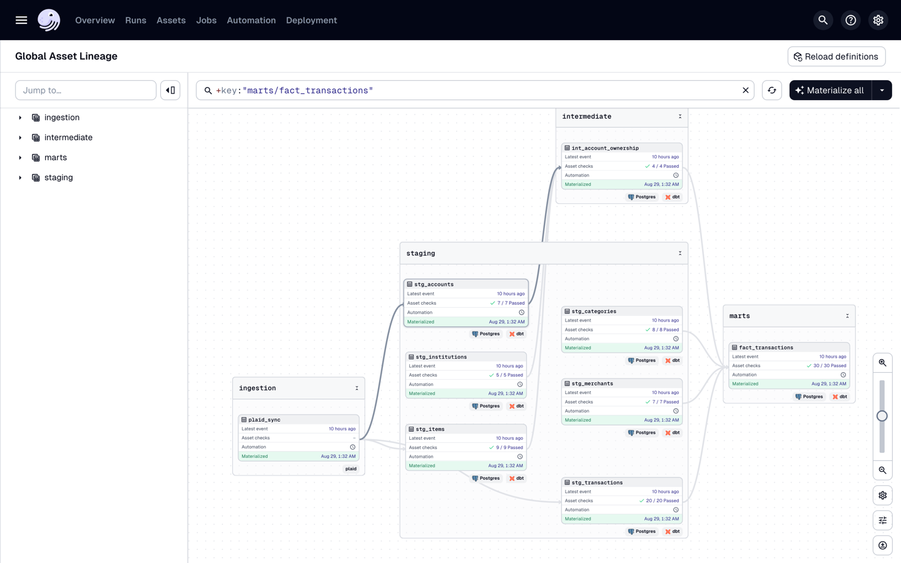
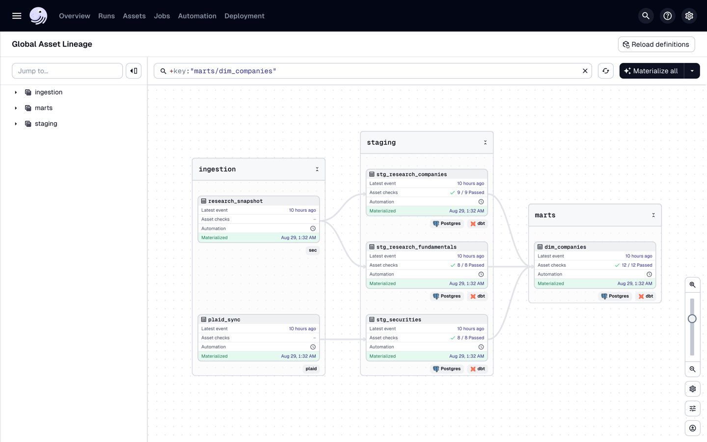
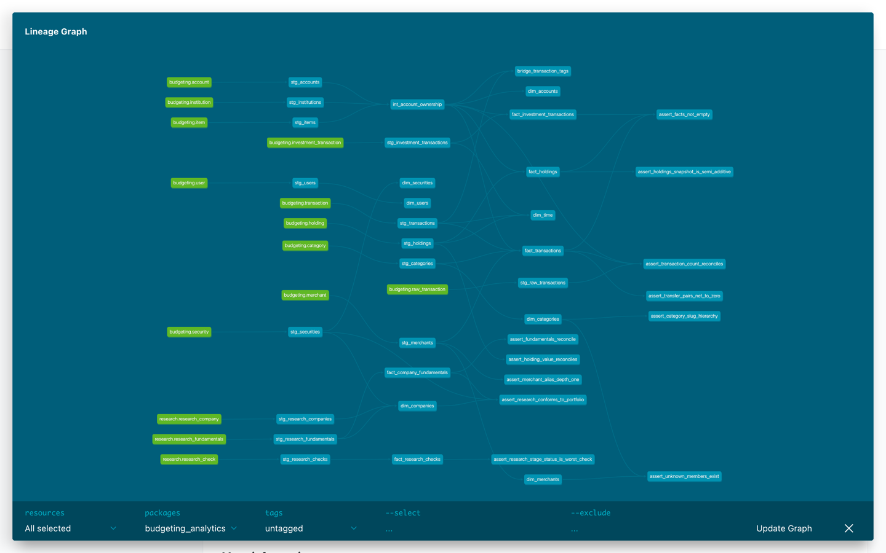

# Personal Finance & Investment Platform

A full-stack budgeting and investing platform I built for my own money — real
bank/brokerage aggregation via Plaid, a four-layer transaction categorization
engine, cash-flow forecasting, portfolio and net-worth tracking, and a
from-scratch equity research tool that scores public companies straight from
their SEC filings.

It's built in five numbered phases, each with its own migration, service
layer, and UI. Screenshots below are from the app running against a
deterministic synthetic dataset (`app.seeds.demo` / `app.seeds.investments`) —
no real account data ever leaves my machine, and the repo ships everything
needed to generate the same fixtures yourself.


---

## Why this exists

It's a real system I use to manage real money, so **correctness beat speed
everywhere it mattered**: integer-cents storage (never a float touches a
dollar amount), idempotent Plaid ingestion, raw-payload preservation for
replay, and a database `CHECK` constraint that ties transaction direction to
the sign of the amount so a bad write fails loudly instead of quietly
corrupting a balance.

Auth is deliberately out of scope — it's a single-user system seeded from
`DEV_USER_EMAIL` — but the `user → item → account → transaction` ownership
chain is enforced in every query from day one, so bolting on real auth later
is a swap of one function, not a schema rework.

---

## Feature tour

### Transaction ledger & Plaid ingestion (Phase 1)

Cursor-based delta sync against Plaid's `transactions_sync`, with pending →
posted collapsing (a bank issues a pending auth, then a *separate* posted
transaction later — naive ingestion double-counts it), Fernet-encrypted access
tokens, and a Redis lock per item so a webhook and a manual sync can never
race the same cursor. Every balance on screen is clickable and drills into
its own filtered transaction list.


### Categorization, transfers & budgets (Phase 2)

A four-layer categorization engine (user rules → merchant defaults → Plaid's
category → uncategorized, first match wins, and a human's choice can never be
silently overwritten) feeds a pacing-aware budget view. Internal transfers and
credit-card payments are detected and excluded from spend — otherwise paying
your own card is double-counted as the largest "expense" of the month.


### Recurring detection, subscriptions & forecasting (Phase 3)

Recurring streams are promoted only when **both** a cadence test and an
amount test agree — cadence alone would flag a daily coffee habit as a
subscription, amount alone would flag every stable-priced purchase as
recurring. The subscriptions view surfaces price hikes, cancelled plans, and
"expected but never charged" gaps; the forecast projects daily cash balance
forward and flags the date it's expected to dip below a safe floor.


### Investments, net worth & goals (Phase 4)

Portfolio value is resolved per account from each account's *newest* snapshot
independently (a global `MAX(as_of_date)` would silently drop an account that
synced on a different day and under-report the portfolio with no error). Cost
basis is nullable and excluded from gain calculations when unknown, rather
than defaulting to zero and reporting an ACATS-transferred position as 100%
profit. Net worth is reconstructed backwards through the ledger for days with
no stored snapshot, and every balance's sign is derived from account type
rather than trusted, since Plaid and the demo fixtures disagree on sign
convention for the same account type.


### Equity research: a four-stage SEC-sourced scorecard (Phase 5)

Look up any SEC-registered ticker and get a **four-stage fundamental
scorecard** built entirely from that company's own filings — no vendor
fundamentals API, because the whole point is that every number is auditable
back to a specific accession number on EDGAR:

1. **Qualitative & Moat** — revenue durability (recurring vs. transactional,
   classified from 10-K Item 1/1A language), customer concentration (>10% of
   revenue from one customer), insider & executive ownership from the DEF 14A
   proxy.
2. **Income Statement & Growth** — 5-year revenue CAGR against a 10% bar,
   gross/operating margin direction, and whether the diluted share count is
   shrinking (buybacks) or growing (dilution).
3. **Balance Sheet Health** — cash & short-term investments vs. long-term
   debt, debt-to-equity below 1.5x, operating income covering interest
   expense at least 5x (skipped for banks, where interest is the cost of
   funds, not debt service).
4. **Cash Flow & Valuation** — free cash flow vs. net income (earnings
   quality), return on equity above 15%, and the P/E and PEG the market is
   charging for that growth.

Every check ships PASS/WARN/FAIL/**UNKNOWN** — a missing input is never
silently treated as a pass, and a negative-equity or zero-base input returns
"not meaningful" rather than a technically-valid, financially-nonsense ratio.
The XBRL parser also detects and restates stock splits across the taxonomy
change that would otherwise show NVIDIA's 10-for-1 as 880% dilution.


*(Full scorecard: [`docs/screenshots/research-aapl.png`](docs/screenshots/research-aapl.png))*

---

## Architecture

```
.
├── docker-compose.yml        # TimescaleDB + Redis (+ optional dockerized API)
├── backend/                  # FastAPI + SQLAlchemy + Alembic
│   ├── alembic/versions/     # 0001 schema · 0002 categorization/budgets ·
│   │                         # 0003 recurring/forecast · 0004 investments/goals
│   └── app/
│       ├── core/             # config, db session, redis, encryption
│       ├── models/           # account, transaction, budget, recurring_stream,
│       │                     # holding, investment_transaction, financial_goal, …
│       ├── schemas/          # pydantic request/response models
│       ├── routers/          # plaid, accounts, transactions, budgets, recurring,
│       │                     # forecast, investments, net_worth, goals, research
│       ├── services/         # ingestion, matching, normalization, categorization,
│       │                     # transfers, budgets, recurring, forecasting,
│       │                     # investment, net_worth, goals, sec_client, xbrl,
│       │                     # filings, market_data, research
│       └── seeds/            # deterministic synthetic fixtures for every phase
├── frontend/                 # Next.js App Router + Tailwind + hand-rolled SVG charts
│   └── app/
│       ├── budgets/ subscriptions/ forecast/ investments/
│       ├── net-worth/ goals/ research/[ticker]/
│       └── page.tsx          # ledger
├── analytics/                # ELT layer — additive, writes only to analytics_* schemas
│   ├── dbt/
│   │   ├── models/           # staging/ → intermediate/ → marts/
│   │   ├── tests/            # 11 singular tests encoding business rules
│   │   └── macros/
│   ├── dagster_budgeting/    # assets_ingest · assets_research · assets_dbt · definitions
│   ├── ddl/landing.sql       # SEC snapshot landing tables
│   └── tests/                # analytics-only pytest (separate rootdir from backend/)
└── Makefile                  # make demo · dagster · dbt-docs · demo-reset
```

**Backend:** FastAPI (sync endpoints on the threadpool — the work is blocking
Plaid/SEC HTTP calls and blocking Redis, so `async def` would only stall the
event loop), SQLAlchemy 2.x + Alembic, PostgreSQL via TimescaleDB (hypertable
for balance snapshots), Redis for per-item sync locks, Fernet for
encryption-at-rest, `httpx` for SEC EDGAR with an explicit rate limiter.

**Frontend:** Next.js App Router, Tailwind, hand-rolled SVG charts (no
charting library) for the balance/net-worth/allocation/forecast views.

---

## Getting started locally

### Prerequisites

| Tool | Version |
| --- | --- |
| Docker Desktop | any recent (verified 29.6.2 / Compose v5.3.1) |
| Python | 3.11+ (3.14 verified) |
| Node.js | 20+ (24 verified) |

### 1. Configure environment

```bash
cp .env.example .env
python3 -c "from cryptography.fernet import Fernet; print(Fernet.generate_key().decode())"  # paste into ENCRYPTION_KEY
python3 -c "import secrets; print(secrets.token_urlsafe(32))"                               # paste into API_KEY

git config core.hooksPath .githooks   # blocks secrets and dumps from being committed
```

`API_KEY` has no default and the API refuses every request without it — an auth
gate that ships with a fallback is one somebody forgets to change. The same
value goes in `frontend/.env.local` as `NEXT_PUBLIC_API_KEY` in step 4; if the
two disagree the UI reports it rather than failing as a network error.

### 2. Start Postgres + Redis, run migrations

```bash
docker compose up -d db redis
cd backend
python3 -m venv .venv && .venv/bin/pip install -r requirements.txt
.venv/bin/alembic upgrade head
```

### 3. Load synthetic data — no Plaid account needed

```bash
.venv/bin/python -m app.seeds.categories      # taxonomy + Plaid category mapping
.venv/bin/python -m app.seeds.demo            # 26 months of ledger: bills, subscriptions, noise
.venv/bin/python -m app.seeds.investments     # brokerage/401k/IRA holdings, a mortgage, 5 goals
```

Every seed is idempotent and namespaced under `DEMO_*` provider ids, so
`--clear` removes it without touching real Plaid-linked data.

### 4. Run the API and frontend

```bash
.venv/bin/uvicorn app.main:app --reload --port 8000       # from backend/
cd ../frontend && npm install && cp .env.local.example .env.local && npm run dev
```

Put the `API_KEY` from step 1 into `frontend/.env.local` as `NEXT_PUBLIC_API_KEY`
before starting the dev server — Next.js inlines it at build time, so a change
needs a restart.

Open <http://localhost:3000>. API docs at <http://localhost:8000/docs>. The docs
page loads, but calls from it answer 401 without the key; use `curl -H
"X-API-Key: …"` or the app itself.

### Optional: link a real bank instead (Plaid Sandbox)

Fill in `PLAID_CLIENT_ID` / `PLAID_SECRET` (sandbox) from the
[Plaid dashboard](https://dashboard.plaid.com/developers/keys), click **Link
account**, pick any institution, and use `user_good` / `pass_good` (MFA
`1234`). The backend exchanges the token and runs a full backfill
immediately; **Sync** re-runs the cursor-based delta pull any time.

### Optional: stock research needs no account linking at all

`/research/<ticker>` works out of the box against live SEC EDGAR data — try
`/research/AAPL`. Set `FINNHUB_API_KEY` for live P/E/PEG, or it falls back to
the last synced price in your portfolio (or reports "unknown" rather than
guessing).

---

## API surface (selected)

| Method | Path | Purpose |
| --- | --- | --- |
| POST | `/api/v1/plaid/link-token` | Create a Link token |
| POST | `/api/v1/plaid/set-access-token` | Exchange `public_token`, backfill |
| POST | `/api/v1/plaid/sync` | Cursor-based delta sync |
| GET | `/api/v1/accounts` | Balances, cash vs. credit liabilities |
| GET | `/api/v1/transactions` | Ledger with search/date/account/category filters |
| GET | `/api/v1/budgets` | Pacing report for a period |
| POST | `/api/v1/budgets/suggestions/apply` | Trailing-median limit suggestions |
| GET | `/api/v1/subscriptions` | Active/paused/cancelled recurring commitments |
| GET | `/api/v1/forecast` | Rolling daily cash-balance projection |
| GET | `/api/v1/investments` | Portfolio value, allocation, per-account drilldown |
| GET | `/api/v1/net-worth/history` | Reconstructed daily net worth |
| GET | `/api/v1/goals` | Progress, required vs. observed monthly contribution |
| GET | `/api/v1/research/{ticker}` | Four-stage SEC-sourced scorecard |

Full interactive docs: `/docs` (FastAPI/OpenAPI).

---

## Analytics: a tested star schema on dbt + Dagster

Everything above is OLTP — every read is a point query scoped to one user. That
shape has no answer for *analytical* questions: spend by category by month,
holdings drift over time, fundamentals history for a ticker. The `analytics/`
directory adds a dimensional model, a version-controlled transformation layer,
and an orchestrator that runs it on a schedule and fails loudly when the data is
wrong.

It is **purely additive**. No existing model, service, router, migration or test
was modified, and every new object lands in a new schema — never `public`.

### One command

```bash
make demo          # createdb → migrate → seed → ingest → research → build + test
make dagster       # asset graph and lineage      → localhost:3030
make dbt-docs      # dbt's own lineage graph      → localhost:8085
make demo-reset    # drop the demo database and do it all again
```

`make demo` targets **`budgeting_demo`**, a separate database of synthetic
fixtures. That matters more than it looks: the marts, `dbt docs` and the Dagster
UI all faithfully render whatever they point at, and pointed at the development
database every one of them is a picture of somebody's real finances. Every
screenshot below is of `budgeting_demo` for exactly that reason.



Filtered to `+key:"marts/fact_transactions"`. This is the whole argument for
Dagster in one picture: `plaid_sync` is a real upstream node, not a preceding
task, so every dbt model downstream of it knows the ingestion is its parent —
and each model carries its own passing check count (`20 / 20` on
`stg_transactions`, `30 / 30` on `fact_transactions`) rather than hiding
inside one opaque `dbt build` box.

### The model

Three fact grains, which is what makes it a star schema rather than a pile of
tables:

| Fact | Grain |
| --- | --- |
| `fact_transactions` | one row per transaction — a classic transaction fact |
| `fact_holdings` | account × security × date — a **periodic snapshot**, semi-additive |
| `fact_company_fundamentals` | company × fiscal year |
| `fact_investment_transactions` | one row per investment transaction |
| `fact_research_checks` | company × snapshot date × stage × check |

Conformed dimensions: `dim_time`, `dim_accounts`, `dim_categories`,
`dim_merchants`, `dim_users`, `dim_securities`, `dim_companies`, plus
`bridge_transaction_tags` for the `text[]` that cannot enter a surrogate key.

**`dim_securities.ticker_symbol` ↔ `dim_companies.ticker` is the conformed
dimension**, and it joins two source systems that agree on nothing else — Plaid
issues its own security id per item, the SEC issues CIKs, neither has heard of
the other. Ticker is the only value both emit for the same company.



Filtered to `+key:"marts/dim_companies"`: `plaid_sync` and `research_snapshot`
enter from two unrelated APIs and meet in one dimension. The normalisation that
makes the join work — `nullif(upper(trim(…)), '')`, applied identically on both
sides — happens in staging rather than at the join, because if only one side
normalises the join returns *zero rows* and reports it as "no research
available" rather than as an error.

Some decisions worth defending:

- **No incremental models anywhere.** `services/ingestion.remove_transaction`
  does `db.delete(txn)` — removals are *hard deletes*, with no `is_removed` and
  no `deleted_at`. An incremental `fact_transactions` would retain rows that no
  longer exist and drift further from reality every run. At ~10³ rows a full
  rebuild is free, so incremental would buy nothing and cost correctness.
- **Every user-scoped fact carries `user_id`** with `not_null` and a
  `relationships` test. With one seeded user a missing ownership filter returns
  the right answer anyway, so a mart without `user_id` would bake that trap
  into the warehouse.
- **The research marts deliberately have no `user_id`** — public filings belong
  to nobody. The join to a person runs through ticker.
- **Staging is `table`, not `view`.** A view in another schema takes a catalog
  dependency on `public`, which would break the bare `drop_all()` in
  `tests/test_object_ownership.py` with an error pointing nowhere near the cause.
- **The SEC research module persists nothing** — it returns a transient report —
  so a Dagster asset lands dated snapshots. That is what turns a request-scoped
  verdict into history: which check flipped PASS→FAIL, and when.

### Why Dagster, not Airflow

Chosen on fit, and the tradeoff is written down rather than hidden.

- `dagster-dbt` makes every dbt model a **first-class asset**, so the DAG *is*
  the lineage graph — `plaid_sync → staging → intermediate → marts`, 34 assets.
  An Airflow DAG would show one opaque `dbt build` task and the lineage would
  live only in dbt docs.
- Every dbt test becomes an **asset check** attached to the model it tests —
  245 of them — instead of pass/fail buried in a run log.
- Asset semantics ("this table should exist and be fresh") match idempotent
  full-refresh better than task semantics ("run this, then that").
- One container beside the existing `db`/`redis`, versus Airflow's webserver +
  scheduler + metadata database for a single daily job.
- **Honest counterpoint:** Airflow has far more market share and a far larger
  hiring pool. For a one-job pipeline whose value is lineage and data quality,
  Dagster fits better; for a large heterogeneous scheduling estate it would not
  obviously win.

### Why `dbt build`, never `dbt run` then `dbt test`

The single most important decision in the orchestration. `build` interleaves per
node: it materialises a model, immediately runs that model's tests, and **skips
every dependent if a test fails**. `run` followed by `test` would materialise
the entire mart layer on top of known-bad data and only complain afterwards — by
which point the marts are wrong, published, and green.

Verified rather than assumed: breaking a staging model produced
`PASS=235 ERROR=1 SKIP=34` with `fact_transactions` explicitly **skipped**.

### Data quality: dbt tests, and why not Great Expectations

**322 data tests across 28 models** run on every build — `not_null`, `unique`,
`relationships`, `accepted_values`, `accepted_range`,
`unique_combination_of_columns`, plus eleven singular tests encoding real
business rules. (`dbt build` reports `PASS=350`, counting the models it
materialises alongside the tests.) `store_failures: true`, so failing rows land
in `analytics_test_failures` and are inspectable rather than just a count.

Great Expectations was evaluated and **declined**:

- Its real differentiators are distributional expectations, automated profiling,
  and unifying quality checks across *heterogeneous* sources. This is one
  Postgres database, ~10³ rows, one transformation tool.
- Everything needed here dbt does natively **inside the same DAG**, with
  `build`'s skip-downstream semantics. GE runs *outside* that DAG, so a GE
  failure would not stop a downstream model from building — which directly
  undercuts the requirement it would supposedly serve.
- It is a second metadata store, a second config language, and a second place
  for a failure to hide. More quality tooling is not more quality.
- If distributional checks are ever wanted, `dbt_expectations` provides
  GE-style expectations *as dbt tests* with no extra infrastructure. That is the
  upgrade path — not GE itself.

### The tests that actually matter

Every test here is of the form "return the rows that violate me". On an **empty
table every one of them passes**, so a build against an unseeded database
produces empty marts and a perfectly green suite — the pipeline reporting
healthy at the exact moment it has no data. Two tests exist solely to close
that hole: `assert_facts_not_empty` and `assert_research_conforms_to_portfolio`.

Others worth naming:

- **`assert_transfer_pairs_net_to_zero`** — the two legs of an internal transfer
  must sum to zero, and a pair must not span two users. No database constraint
  enforces this; a broken pair silently double-counts money movement as spend.
- **`assert_transaction_count_reconciles`** — `raw_transaction` added − removed
  against the live `transaction` count. The only test that can detect a hard
  delete.
- **`assert_research_stage_status_is_worst_check`** — re-derives the framework's
  rollup rule (worst verdict wins; an UNKNOWN cannot be papered over by a PASS)
  and compares it against what the service actually said.
- **`assert_fundamentals_reconcile`** — free cash flow must equal operating cash
  flow minus capex. Filers tag capex with either sign, so this is a live risk;
  an injected sign flip surfaced as a $25bn discrepancy.

**Every guard above was confirmed to fire before being trusted.** Each was
broken on purpose and the build watched go red. That habit is load-bearing in
this repo: the `.githooks` private-key rule silently never fired for its entire
life, and a check that accepts everything passes any happy-path test.

The sharpest demonstration: lower-casing the ticker in one staging model left
**349 of 350 nodes green** and only the conformance test red. Nothing else in
the suite can see a join that silently matches nothing.



`make dbt-docs`. Green nodes on the left are sources — the OLTP tables and the
`analytics_landing` research tables — flowing right through staging and the
marts. The terminal nodes on the right are the singular tests: they sit
*downstream* of the models they guard, which is why `dbt build` can skip a
model's dependents the moment one of them fails.

### Security notes specific to this layer

- **`.gitignore` carries `*.sql`** — a `pg_dump` of this database holds live
  Plaid tokens and every real transaction, a worse leak than `.env`. Every dbt
  model therefore needs an explicit negation to be committable at all.
  `make verify-gitignore` asserts **both** directions: models are tracked *and*
  a stray dump still is not.
- **A dedicated `budgeting_analytics` role** with `SELECT` on `public` and no
  `INSERT`/`UPDATE`/`DELETE`, so "marts must never be written into `public`" is
  a database guarantee rather than a convention. `access_token` is revoked
  column-by-column — a table-level `GRANT` implicitly covers every column and
  Postgres will not let a column-level `REVOKE` subtract from it, so the first
  version of that script looked right and granted the token anyway.
- **`dbt target/`, `logs/` and `dbt_packages/` are ignored.** `manifest.json`
  embeds compiled SQL, `catalog.json` carries row counts and column stats, and
  `logs/dbt.log` at debug level carries real merchant names and amounts.
- **Telemetry off on both tools** (`send_anonymous_usage_stats: false`,
  `telemetry.enabled: false`). Both phone home by default.
- **Dagster instance storage is SQLite on a named volume**, not
  `dagster-postgres`, which would write ~12 tables *and its own
  `alembic_version`* into `public` — where the app's `include_schemas=False`
  autogenerate would then propose dropping all of them.
- **No amounts in materialisation metadata.** Row counts only, and deliberately
  not `fetch_column_metadata()`: the min and max of `signed_amount_cents` are
  the user's largest transactions, and the Dagster event log has none of the
  protections the database has.

---

## Engineering notes worth knowing

- **Integer cents, everywhere.** Every currency column is `BIGINT` minor
  units; conversion from Plaid's float happens once, via `Decimal(str(x))`,
  never `Decimal(x)` — building a `Decimal` straight from a float inherits
  its binary rounding error.
- **Idempotent by construction.** All writes key on `provider_txn_id`; a
  duplicate webhook, a retried request, or a rewound cursor converges to the
  same rows instead of duplicating them. The sync cursor commits in the same
  transaction as the data it advanced past, so a crash mid-page resumes
  exactly where it left off rather than skipping or replaying.
- **Raw payloads are preserved** in an append-only `raw_transaction` table
  before normalization — a normalization bug is replayable, since re-pulling
  from Plaid after the cursor has advanced is not an option.
- **A human's category choice is sacred.** Every automated categorization
  path checks `category_source != 'USER'` before writing; the only way past
  it is an explicit `force=True` from a caller that knows the user asked.
- **Recurring detection needs two independent signals to agree** (cadence
  *and* amount) before calling something a subscription — either alone
  produces false positives in opposite directions.
- **A missing filing value is `UNKNOWN`, never a guess.** The research
  engine's central rule: dividing by an absent interest-expense figure and
  calling it "infinite coverage" would award a green flag to a company with
  $90bn of debt purely because a number wasn't tagged.
- **Every number in the research report traces to a filing URL.** SEC EDGAR
  is the primary source specifically because a vendor fundamentals API
  can't be audited and an XBRL fact with an accession number can.

---

## Status

Five phases built and browser-verified end to end, including a production
Plaid Link flow (OAuth institutions, webhook-driven sync). Auth is the one
deliberately deferred piece — see "Why this exists" above for why that's a
contained gap rather than a structural one. This repo is public and contains
no real financial data, credentials, or account identifiers; the app itself
has no auth layer, so if you run it, keep it on `localhost`.
